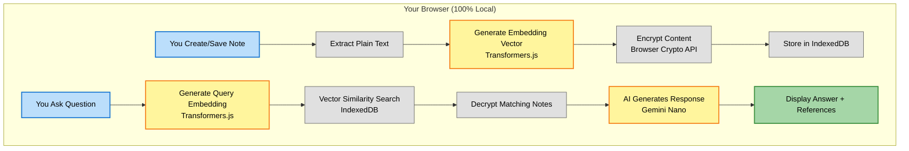
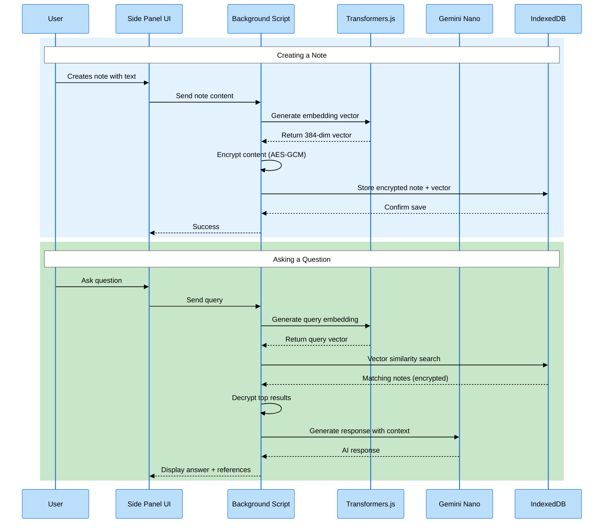

# 🧠 MindKeep User Guide

> **Your Personal AI-Powered Second Brain**
> MindKeep is a revolutionary Chrome extension that helps you save, organize, and instantly recall information—all while keeping your data 100% private on your local machine.

---

## 📖 Table of Contents

- [Overview](#-overview)
- [Key Features](#-key-features)
- [How It Works](#-how-it-works)
- [Getting Started](#-getting-started)
- [Core Features](#-core-features-in-detail)
  - [Side Panel: Your Note Hub](#-side-panel-your-note-hub)
  - [AI Search Bar](#-ai-search-bar-intelligent-retrieval)
  - [Rich Text Editor](#-rich-text-editor)
  - [In-Page Assistant](#-in-page-assistant)
  - [Personas: Customize AI Behavior](#-personas-customize-ai-behavior)
  - [Context Menu Integration](#-context-menu-integration)
  - [Semantic Search](#-semantic-search)
- [Technology & Privacy](#-technology--privacy)
- [User Interface](#-user-interface)
- [Tips & Best Practices](#-tips--best-practices)
- [Frequently Asked Questions](#-frequently-asked-questions)

---

## 🌟 Overview

**MindKeep** transforms your browser into an intelligent personal knowledge base. Unlike traditional note-taking apps that require manual organization and searching, MindKeep uses **Google's built-in Gemini Nano AI** to understand the meaning of your notes and retrieve exactly what you need through natural conversation.

### What Makes MindKeep Special?

✨ **100% Private** - All AI processing happens locally in your browser using Google's Gemini Nano

🧠 **Semantic Understanding** - Finds notes by meaning, not just keywords

💬 **Conversational AI** - Ask questions naturally and get intelligent answers

🎨 **Rich Text Support** - Format your notes with tables, images, links, and more

🔐 **Encrypted Storage** - Your notes are encrypted at rest in your browser

⚡ **Lightning Fast** - No server round-trips, everything runs locally

🎭 **Customizable Personas** - Tailor AI responses to your specific needs

---

## 🎯 Key Features

### 1. **Intelligent Note Management**

- Create, edit, and organize notes with a beautiful rich text editor
- Automatic categorization with AI-suggested categories
- Auto-generated titles by AI for quick note creation
- Source URL tracking for web content

### 2. **AI-Powered Retrieval**

- Ask questions in natural language
- Semantic search understands context, not just keywords
- Conversational AI remembers your discussion
- Reference notes displayed with answers

### 3. **In-Page Assistance**

- AI assistant appears on any input field across the web
- Context-aware suggestions based on your notes
- Insert AI-generated content directly into forms

### 4. **Persona System**

- Create custom AI personas for different tasks
- Built-in personas: Email Writer, Code Helper, Meeting Brief
- Personas adapt AI responses to your specific needs

### 5. **Privacy-First Design**

- No data ever leaves your device
- Google's Gemini Nano runs entirely in your browser
- Encrypted storage with browser-native crypto
- Zero external API calls

---

## 🔄 How It Works

MindKeep uses a sophisticated local-first architecture:



### The Technology Stack

| Component               | Technology              | Purpose                                   |
| ----------------------- | ----------------------- | ----------------------------------------- |
| **AI Model**            | Google Gemini Nano      | Local language understanding & generation |
| **Embedding**           | Transformers.js         | Convert text to semantic vectors          |
| **Storage**             | Dexie.js + IndexedDB    | Fast, encrypted local database            |
| **Encryption**          | Web Crypto API          | Secure content encryption at rest         |
| **Editor**              | TipTap                  | Rich text editing with markdown support   |
| **UI Framework**        | React 18 + Tailwind CSS | Modern, responsive interface              |
| **Extension Framework** | Plasmo                  | Chrome extension development              |

---

## 🚀 Getting Started

### Prerequisites

To use MindKeep, you need:

1. **Google Chrome** (version 127 or later)
2. **Chrome Flags Enabled**:
   - Navigate to `chrome://flags`
   - Enable these flags:
     - `#optimization-guide-on-device-model` → **Enabled**
     - `#prompt-api-for-gemini-nano` → **Enabled**
     - `#summarization-api-for-gemini-nano` → **Enabled**
3. **Restart Chrome** after enabling flags

---

## 🎨 Core Features in Detail

### 📋 Side Panel: Your Note Hub

The side panel is your central command center for all notes.

#### **Header Section**

- **Close Button**: Minimize the side panel
- **Personas Button** : Manage and activate AI personas
- **Create Note Button** (+): Start a new note
- **Search Bar**: Quick text search across titles and content

#### **Category Tabs**

- **All**: View all notes
- **Category-specific tabs**: Filter by category (e.g., "work", "personal", "meetings")

#### **Note Cards**

Each note displays:

- **Title** (bold, large text)
- **Preview** (first 2 lines of content)
- **Metadata**: Category badge, creation date
- **Actions**: Edit (✏️) and Delete (🗑️) buttons

---

### 🔍 AI Search Bar: Intelligent Retrieval

Located at the bottom of the side panel, this is where the magic happens.

#### **How to Use**

1. **Ask Questions Naturally**:

   ```
   "What's my Netflix password?"
   "Show me notes about AWS deployment"
   "How do I connect to the production server?"
   ```

2. **Create Notes from Chat**:

   ```
   "Save this as a note: AWS access key is xyz123"
   "Add a note in the work category about the meeting"
   ```

3. **Get Statistics**:
   ```
   "How many notes do I have?"
   "What categories exist?"
   ```

#### **AI Response Features**

- **Streaming Text**: Watch responses appear word-by-word
- **Reference Notes**: Click expandable chips to see which notes were used
- **Suggested Actions**: Copy, fill, or view referenced notes
- **Conversation Memory**: AI remembers context within the session
- **Clarifications**: AI asks for missing information (title, category)

---

### ✍️ Rich Text Editor

When creating or editing notes, you get a powerful editor with:

#### **Formatting Options**

| Feature           | Button   | Description                 |
| ----------------- | -------- | --------------------------- |
| **Bold**          | **B**    | Make text bold              |
| **Italic**        | _I_      | Italicize text              |
| **Underline**     | <u>U</u> | Underline text              |
| **Strikethrough** | ~~S~~    | Cross out text              |
| **Code**          | `</>`    | Inline code formatting      |
| **Headings**      | H1-H3    | Section headers             |
| **Lists**         | • / 1.   | Bullet and numbered lists   |
| **Blockquote**    | "        | Quoted text blocks          |
| **Code Block**    | {...}    | Multi-line code with syntax |
| **Links**         | 🔗       | Insert hyperlinks           |
| **Images**        | 🖼️       | Embed images                |
| **Tables**        | ⊞        | Create data tables          |
| **Alignment**     | ⬅️ ⬆️ ➡️ | Text alignment              |
| **Colors**        | 🎨       | Text and highlight colors   |

#### **Smart Features**

- **Auto-Title Generation**: Leave title blank, AI creates one from content
- **Category Suggestions**: AI suggests relevant categories as you type
- **Markdown Support**: Type in markdown, get rich formatting
- **Source URL Tracking**: Automatically saves URL when content is from web

#### **Editor Actions**

- **Save**: Stores note with encryption and generates semantic embedding
- **Cancel**: Discards changes and returns to list view

---

### 🪄 In-Page Assistant

MindKeep's most powerful feature - AI assistance anywhere on the web!

#### **How It Works**

1. **Focus on any input field** (text box, textarea, contentEditable)
2. **Look for the MindKeep icon** (appears when field is focused)
3. **Click the icon** to open the floating AI chat modal
4. **Ask questions or request content**
5. **Click "Insert"** to place AI response into the field

#### **Use Cases**

##### 📧 **Email Composition**

```
You: "Write a professional email declining a meeting invitation"
AI: [Generates polite email]
[Insert Button] → Email inserted into Gmail compose box
```

##### 🐛 **Code Assistance**

```
You: "What's the Python code for reading a CSV file?"
AI: [Provides code snippet from your notes or generates new]
[Insert Button] → Code inserted into IDE/editor
```

##### 📝 **Form Filling**

```
You: "What's my company address?"
AI: [Retrieves from notes]
[Insert Button] → Address auto-filled
```

##### 💬 **Social Media**

```
You: "Suggest a LinkedIn post about my recent project"
AI: [Crafts professional post using your notes as context]
[Insert Button] → Post ready to publish
```

#### **Modal Features**

- **Draggable**: Move the modal anywhere on screen
- **Conversation History**: Maintains context during session
- **Persona Support**: Works with active persona
- **Insert Mode**: "Send" button becomes "Insert" for direct field injection

---

### 🎭 Personas: Customize AI Behavior

Personas let you customize how MindKeep responds to queries.

#### **What are Personas?**

A persona is a customized AI mode with:

- **Context**: Instructions that shape AI behavior
- **Output Template**: Consistent formatting for responses
- **Search-Only Mode**: Personas can only read notes, not create/modify them

#### **Built-in Personas**

##### **1. Email Writer Persona**

- **Purpose**: Craft professional emails
- **Context**: "You're a professional email assistant..."
- **Best For**: Business correspondence, formal communications

##### **2. Code Helper Persona**

- **Purpose**: Assist with programming tasks
- **Context**: "You're a technical coding assistant..."
- **Best For**: Code snippets, debugging, documentation

##### **3. Meeting Brief Persona**

- **Purpose**: Summarize meetings and create action items
- **Context**: "You're a meeting summarization assistant..."
- **Best For**: Meeting notes, action items, summaries

#### **Using Personas**

1. **Activate a Persona**:

   - Click the **Personas button** (👤) in the head AI chat
   - Select a persona from the list
   - Active persona shows with a checkmark

2. **See Persona Indicator**:

   - Active persona name appears in AI search bar
   - Example: "Email Writer • Ask me anything..."

3. **Deactivate**:
   - Click "Deactivate" button in persona card
   - Returns to default mode (full tool access)

#### **Creating Custom Personas**

1. Open Personas management page (Click persona dropdown in AI chat and click manage persona)
2. Click "Create New Persona"
3. Fill in:
   - **Name**: e.g., "Sales Proposal Writer"
   - **Description**: Brief purpose
   - **Context**: Detailed instructions
   - **Output Template** (optional): Format guide
4. Save and activate

**Example Custom Persona**:

```
Name: Sales Proposal Writer
Description: Helps create compelling sales proposals

Context:
You are a sales expert who helps create professional proposals.
When asked to write a proposal:
1. Start with a compelling value proposition
2. Include customer pain points you've noted
3. Propose solutions with clear benefits
4. End with a strong call to action
Always maintain a confident, professional tone.

Output Template:
# Proposal for [Client Name]

## Executive Summary
[Brief overview]

## Pain Points
- [Point 1]
- [Point 2]

## Our Solution
[Detailed solution]

## Next Steps
[Call to action]
```

---

### 📋 Context Menu Integration

Save web content to MindKeep with a right-click!

#### **How to Use**

1. **Select text** on any webpage
2. **Right-click** the selection
3. **Choose "Save to MindKeep"** from the menu
4. **Side panel opens** with selected content pre-filled
5. **Content preserves formatting** (HTML is converted to rich text)
6. **Source URL is automatically saved**

#### **What Gets Saved**

- ✅ **Text formatting**: Bold, italic, underline, colors
- ✅ **Links**: Hyperlinks are preserved
- ✅ **Structure**: Headings, lists, blockquotes
- ✅ **Source URL**: For reference back to original page

---

### Semantic Search

MindKeep's search goes beyond keyword matching.

#### **How Semantic Search Works**

Traditional search finds exact word matches:

```
Query: "login credentials"
Finds: Notes containing "login" AND "credentials"
Misses: Notes with "username and password", "access keys", "auth tokens"
```

Semantic search understands meaning:

```
Query: "login credentials"
Finds:
  ✅ "Netflix username and password"
  ✅ "AWS access keys"
  ✅ "Database authentication tokens"
  ✅ "SSH private key for server"
```

#### **Embedding-Based Search**

1. **Note Creation**: Each note is converted to a 384-dimensional vector (embedding)
2. **Query Processing**: Your question is converted to the same vector space
3. **Similarity Matching**: Finds notes with vectors closest to query vector
4. **Ranked Results**: Returns most relevant notes first

#### **Search Tips**

✨ **Ask naturally**: "How do I deploy to production?" works better than "deploy production"
✨ **Use context**: "What was discussed in yesterday's meeting?" vs "meeting notes"
✨ **Be specific**: "Netflix login" vs "password"
✨ **Conversational follow-ups**: "What about the AWS account?" after "What's my Netflix password?"

---

## 🔐 Technology & Privacy

### Data Flow Architecture



### Privacy Guarantees

#### ✅ **What Stays Local**

- **All your notes** - Stored only in your browser's IndexedDB
- **All AI processing** - Gemini Nano runs 100% on your device
- **Embeddings** - Semantic vectors never leave your machine
- **Conversations** - Session history stored only in browser memory

#### ✅ **Encryption**

- **Algorithm**: AES-GCM (256-bit)
- **Key Storage**: Browser-native SubtleCrypto API
- **What's Encrypted**:
  - Note content (rich text JSON)
  - Note plaintext (for display)
- **What's NOT Encrypted** (for performance):
  - Note titles (needed for search/display)
  - Categories (needed for filtering)
  - Embedding vectors (needed for semantic search)

#### ❌ **No External Servers**

MindKeep **NEVER**:

- ❌ Sends your data to any server
- ❌ Makes external API calls
- ❌ Tracks your usage
- ❌ Collects analytics
- ❌ Requires login or account

### System Requirements

| Requirement  | Specification                         |
| ------------ | ------------------------------------- |
| **Browser**  | Google Chrome 127+                    |
| **RAM**      | 8GB minimum (AI model runs in memory) |
| **Storage**  | ~2GB for Gemini Nano model            |
| **Internet** | Only for initial model download       |

---

## 🎨 User Interface

### Color System

MindKeep uses a carefully designed color palette:

| Element        | Color                 | Purpose                       |
| -------------- | --------------------- | ----------------------------- |
| **Primary**    | Blue (`#3b82f6`)      | Actions, links, active states |
| **Success**    | Green (`#22c55e`)     | Confirmations, success states |
| **Warning**    | Yellow (`#f59e0b`)    | Cautions, pending states      |
| **Error**      | Red (`#ef4444`)       | Errors, destructive actions   |
| **Background** | Slate (`#f8fafc`)     | Panel backgrounds             |
| **Text**       | Slate-900 (`#0f172a`) | Primary text                  |

### Responsive Design

- **Side Panel**: Fixed 400px width (Chrome standard)
- **Note Cards**: Fluid width with consistent padding
- **Modal**: Adaptive positioning based on viewport
- **Mobile**: Not applicable (Chrome extensions are desktop-only)

### Accessibility

- ♿ **Keyboard Navigation**: Tab through all interactive elements
- ♿ **Focus Indicators**: Clear blue outlines on focused items
- ♿ **ARIA Labels**: Screen reader support
- ♿ **Color Contrast**: WCAG AA compliant

---

## 💡 Tips & Best Practices

### 📝 **Note-Taking Tips**

1. **Use Descriptive Titles**: Makes browsing easier
2. **Leverage Categories**: Group related notes (work, personal, projects)
3. **Add Context**: Include why you saved something, not just what
4. **Use Rich Formatting**: Tables for data, code blocks for snippets
5. **Save Source URLs**: Always know where information came from

### 🔍 **Search Tips**

1. **Ask Complete Questions**: "What's my Netflix password?" vs "Netflix"
2. **Use Conversational Language**: The AI understands natural speech
3. **Follow Up**: "What about AWS?" works if context is established
4. **Be Specific**: More detail = better results

### 🎭 **Persona Tips**

1. **Match Task to Persona**: Use Email Writer for emails, Code Helper for programming
2. **Customize Templates**: Create personas for your specific workflows
3. **Search-Only Mode**: Personas prevent accidental note modifications
4. **Switch Personas**: Change based on current task

### ⚡ **Performance Tips**

1. **Regular Cleanup**: Delete old/irrelevant notes
2. **Consolidate Notes**: Merge related notes to reduce search space
3. **Use Categories**: Helps with organization and filtering
4. **Restart Browser**: Occasionally refresh Gemini Nano instance

---

## ❓ Frequently Asked Questions

### **Q: Is my data really private?**

**A:** Yes! 100% of your data stays in your browser. Gemini Nano runs locally, and there are zero external API calls. Your notes are encrypted and stored only in IndexedDB on your device.

---

### **Q: What happens if I clear browser data?**

**A:** Clearing Chrome's storage will delete all your notes. MindKeep uses IndexedDB, which is cleared when you wipe browser data. Always back up important notes outside the browser if needed.

---

### **Q: Why is the AI download so large?**

**A:** Gemini Nano is a sophisticated language model (1-2GB). This one-time download enables all local AI features without ever needing internet again.

---

### **Q: Can I use MindKeep on other browsers?**

**A:** Currently, MindKeep only works on **Google Chrome** because Gemini Nano is a Chrome-exclusive feature. Edge, Firefox, and Safari don't support it yet.

---

### **Q: What if AI says "not available"?**

**A:** Ensure you've:

1. Enabled required Chrome flags (`chrome://flags`)
2. Restarted Chrome after enabling flags
3. Allowed model download to complete (check AI Status Banner)
4. Updated Chrome to version 127 or later

---

### **Q: Can I export my notes?**

**A:** Currently, there's no built-in export feature. Notes are stored in IndexedDB. Future versions may include export functionality.

---

### **Q: How does category suggestion work?**

**A:** When typing in the editor, MindKeep analyzes your content with Gemini Nano and suggests relevant existing categories plus new ones based on content theme.

---

### **Q: Can I search by date?**

**A:** Not directly through the UI yet. However, you can ask the AI: "Show me notes from last week" or "What did I save yesterday?"

---

### **Q: What's the note size limit?**

**A:** There's no hard limit, but extremely large notes (>100KB) may slow down embedding generation. Break large content into multiple notes for better performance.

---

### **Q: Does MindKeep work offline?**

**A:** Yes! After the initial Gemini Nano download, MindKeep works 100% offline. All AI features function without internet.

---

### **Q: Can multiple people share notes?**

**A:** No. MindKeep is designed for personal use. Each browser instance has its own isolated data store.

---

### **Q: What about browser sync?**

**A:** Chrome Sync doesn't sync IndexedDB data by design. Your notes stay on each device. This is intentional for privacy.

---

### **Q: How do I delete all notes?**

**A:** Open Chrome DevTools (F12) → Console → Run:

```javascript
chrome.storage.local.clear()
indexedDB.deleteDatabase("mindkeep_db")
```

Then restart the extension.

---

### **Q: Can I customize the AI's personality?**

**A:** Yes! Create custom personas with specific instructions in the "Context" field. The AI will follow those guidelines when the persona is active.

---

### **Q: What languages does MindKeep support?**

**A:** Gemini Nano supports multiple languages, but MindKeep's UI is currently English-only. However, you can save notes in any language.

---

### **Q: Is there a mobile version?**

**A:** No. Chrome extensions are desktop-only. Mobile support isn't technically possible with current Chrome APIs.

---

### **Q: How do I report bugs?**

**A:** Visit the [GitHub repository](https://github.com/your-repo/mind-keep) (if available) or contact the developer.

---

### **Q: Will my notes be compatible with future versions?**

**A:** Yes. The database schema is versioned, and migrations are handled automatically to ensure compatibility.

---

## 🎉 Conclusion

MindKeep transforms how you manage information online. By combining local AI, semantic search, and rich note-taking, it creates a truly intelligent second brain that respects your privacy.

**Key Takeaways**:

- 🔐 **Privacy-first**: All data and AI processing stays local
- 🧠 **Semantic search**: Find notes by meaning, not keywords
- 💬 **Conversational AI**: Natural language interaction
- 🎭 **Customizable**: Personas adapt to your needs
- ⚡ **Lightning fast**: No network latency

---

## 🙏 Credits

**Built with**:

- Google Gemini Nano (On-device AI)
- Plasmo (Extension Framework)
- React (UI Library)
- TipTap (Rich Text Editor)
- Dexie.js (IndexedDB Wrapper)
- Transformers.js (Embedding Generation)

**Created by**: Sundeep Dayalan

---

**Version**: 0.0.1
**Last Updated**: 2025

---

**Enjoy your second brain! 🧠✨**
