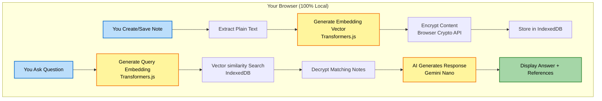

# 🧠 MindKeep: Your Personal AI-Powered Second Brain

> **Note:** This project was built for the **Google Chrome Built-in AI Challenge 2025**.

MindKeep is a revolutionary Note taking Chrome extension that helps you save, organize, and instantly recall information—all while keeping your data 100% private on your local machine. It's a "second brain" that uses Google's built-in Gemini Nano to understand your notes semantically.

## 🎥 Demo Video

**Watch the demo video:** **[Demo](https://youtu.be/FhwTGEgA8R8)**

## 🚀 How to Test (For Judges & Users)

**⚠️ Critical Prerequisite: Enable Chrome AI Flags**

To use MindKeep, you _must_ enable the required Chrome flags:

1.  Navigate to `chrome://flags` in your Chrome browser.
2.  Enable the following flags:
    - `#optimization-guide-on-device-model` → **Enabled**
    - `#prompt-api-for-gemini-nano` → **Enabled**
    - `#summarization-api-for-gemini-nano` → **Enabled**
3.  **Relaunch Chrome** for the changes to take effect.

## Installation

1.  **[Download this repository](https://github.com/sundeep-dayalan/MindKeep/archive/refs/heads/main.zip)** and unzip it.
2.  **Open Terminal:** Open your terminal or command prompt and navigate into the unzipped project folder (e.g., `cd MindKeep-main`).

3.  **Install Dependencies:** Run the following command to install the project's dependencies.

    ```bash
    pnpm install
    ```

4.  **Build the Extension:** Run the following command to create a production build of the extension.

    ```bash
    pnpm run build
    ```

    This will create a new folder named `build/chrome-mv3-prod` containing the ready-to-install extension.

5.  **Load the Extension in Chrome:**

    - Go to `chrome://extensions` in your browser.
    - Enable **"Developer mode"** (using the toggle in the top-right).
    - Click the **"Load unpacked"** button.
    - Select the **`build/chrome-mv3-prod`** folder that was just created (do _not_ select the main project folder).

6.  **Pin the Extension:** MindKeep will be installed! Click the puzzle icon in your toolbar and pin the MindKeep icon for easy access.

---

## 🎯 The Problem: The AI "Catch-22"

We are forced to make an impossible choice every day:

1. Use "Smart" Cloud Tools: Get powerful AI assistance (like in Notion, ChatGPT, or cloud assistants) but only by uploading your most private thoughts, API keys, passwords, and company data to a third-party server.

2. Use "Dumb" Local Tools: Keep your data 100% private (like in a simple .txt file or a basic notes app) but get zero intelligence. Your search is limited to Ctrl+F—it can't find meaning, only exact keywords.

You must choose between an assistant that's smart or one that's private. You cannot have both. Until now.

## ✨ The Solution: MindKeep (The No-Compromise AI)

MindKeep is the first tool to break this "Catch-22." It's an intelligent "second brain" that is both smart and private, by using a revolutionary local-first architecture.

- **How?** Instead of sending your data to the cloud, MindKeep brings the AI to your data.

- **The "Brain"**: It uses **Google's Gemini Nano** (via the chrome.ai API) to run all AI tasks—summaries, Q&A, content generation—entirely on your device.

- **The "Memory"**: It uses **Transformers.js** to create semantic "fingerprints" (vector embeddings) for your notes locally.

When you ask, "What was that AWS key for the production server?" MindKeep doesn't just search for "AWS." It understands the concept of "production credentials" and finds the exact note—all without a single byte of your personal data ever leaving your browser.

**This is the future of personal AI: zero privacy trade-offs, maximum intelligence.**

## 🌟 Key Features

- **🤖 100% Local AI:** Powered by **Google Gemini Nano** (via the `chrome.ai` Prompt API). Your data never leaves your device.
- **🧠 Semantic Search:** Ask questions in natural language. MindKeep finds notes based on conceptual meaning, not just keyword matching.
- **✍️ Rich Text Editor:** A full-featured [TipTap](https://tiptap.dev/product/editor) editor for tables, images, code blocks, lists, and more.
- **🪄 In-Page Assistant:** An AI assistant that appears on _any_ input field on the web to help you write emails, fill forms, or code, all using your notes as context.
- **🎭 Customizable Personas:** Create custom AI behaviors (e.g., "Email Writer," "Code Helper") to tailor responses to specific tasks.
- **📋 Context Menu Saving:** Right-click any selected text to save it directly to MindKeep, preserving formatting and the source URL.
- **🔐 Encrypted Storage:** All your notes are encrypted at rest in your browser's IndexedDB using the **Web Crypto API (AES-GCM)**.

## 🛠️ Core Technologies & APIs Used

This project was built by deeply integrating Chrome's new built-in AI APIs with a modern, local-first tech stack.

### 1. Google Chrome Built-in AI (Gemini Nano)

We use the full suite of available on-device models, each for a specific purpose:

- **Prompt API (`LanguageModel`):** This is the core "brain" of MindKeep. We don't just execute simple prompts; we use `LanguageModel.create()` to build a robust, stateful **session management system**. This allows for conversational follow-ups, token usage tracking (with warnings at 90% quota), and a "Persona" system built on top of `systemPrompt`. This powers the In-Page Assistant and Semantic Q&A features.

- **Summarizer API (`Summarizer`):** This API is used to automatically generate "AI-Suggested Titles" for new notes. When you paste a large block of text and leave the title blank, the Summarizer API creates a concise headline, saving you time.

- **Rewriter API (`Rewriter`):** Integrated directly into the In-Page Assistant. This allows you to highlight text in any
  web form and instantly rewrite it to be "more-formal," "more-casual," "shorter," or "longer," streamlining your writing workflow.

### 2. Local-First & Privacy Stack

To guarantee 100% privacy, no data ever leaves the user's machine.

- **Transformers.js:** This library is the key to our private semantic search. When a note is saved, we use Transformers.js to generate 384-dimensional vector embeddings _locally in the browser_. These vectors are stored alongside the notes.

- **Web Crypto API (`AES-GCM`):** We don't just store data locally; we **encrypt it at rest**. This native browser API is used to encrypt all note content before it's saved to IndexedDB, ensuring your private data is unreadable outside the extension.

- **Dexie.js (IndexedDB):** A high-performance wrapper for IndexedDB that manages the local database of encrypted notes and their (unencrypted) vector embeddings, allowing for fast and efficient vector similarity search.

### 3. Extension & UI Frameworks

- **Plasmo:** A modern, battery-packed framework for building the Chrome extension.
- **React 18 & Tailwind CSS:** For building a responsive, clean, and modern user interface.
- **TipTap:** A headless, "pro-mirror" style rich-text editor that provides a beautiful writing experience.

---

## 🔄 How It Works

MindKeep uses a sophisticated, 100% local-first architecture:



## 📖 Full User Guide

For a detailed breakdown of all features (like the In-Page Assistant, Personas, and Rich Text Editor), tips, and FAQs, please see the:

➡️ **[Full User Guide](./ABOUT.md)**

Built with ❤️ by Sundeep Dayalan.
