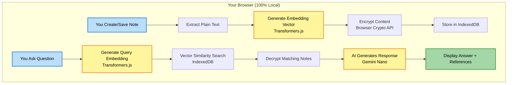

# 🧠 MindKeep: Your Personal AI-Powered Second Brain

> **Note:** This project was built for the **Google Chrome Built-in AI Challenge 2025**.

MindKeep is a revolutionary Chrome extension that helps you save, organize, and instantly recall information—all while keeping your data 100% private on your local machine. It's a "second brain" that uses Google's built-in Gemini Nano to understand your notes semantically.

## 🎥 Demo Video

**Watch the (sub-3-minute) demo video:** **[LINK TO YOUR YOUTUBE/VIMEO DEMO]**

## 🚀 How to Test (For Judges & Users)

**⚠️ Critical Prerequisite: Enable Chrome AI Flags**

To use MindKeep, you _must_ enable the required Chrome flags:

1.  Navigate to `chrome://flags` in your Chrome browser.
2.  Enable the following flags:
    - `#optimization-guide-on-device-model` → **Enabled**
    - `#prompt-api-for-gemini-nano` → **Enabled**
    - `#summarization-api-for-gemini-nano` → **Enabled**
3.  **Relaunch Chrome** for the changes to take effect.

**Installation**

1.  [Download this repository as a ZIP file] **[LINK TO DOWNLOAD REPO AS ZIP]** and unzip it.
2.  Go to `chrome://extensions` in your browser.
3.  Enable **"Developer mode"** (using the toggle in the top-right).
4.  Click **"Load unpacked"**.
5.  Select the unzipped project folder (the one containing `manifest.json`).
6.  MindKeep will be installed! Click the puzzle icon in your toolbar and pin the MindKeep icon (🧠) for easy access.

---

## 🎯 The Problem

In a world of constant information, our digital notes, thoughts, and "things to remember" are scattered across apps, bookmarks, and cloud services. This is not only inefficient but also raises serious privacy concerns, as most "smart" assistants process your data on a server.

## ✨ The Solution: MindKeep

MindKeep transforms your browser into an intelligent, private "second brain." It uses **Google's built-in Gemini Nano** to understand your notes semantically, allowing you to:

- **Save anything** from the web with rich formatting.
- **Find notes by _meaning_, not just keywords.** Ask "What's my AWS key?" and it finds "Note: AWS Access - xyz123".
- **Keep your data 100% private.** All AI processing, embedding, and data storage happens _only_ on your local machine. Nothing ever leaves your browser.

## 🌟 Key Features

- **🤖 100% Local AI:** Powered by **Google Gemini Nano** (via the `chrome.ai` Prompt API). Your data never leaves your device.
- **🧠 Semantic Search:** Ask questions in natural language. MindKeep finds notes based on conceptual meaning, not just keyword matching.
- **✍️ Rich Text Editor:** A full-featured [TipTap](https://tiptap.dev/) editor for tables, images, code blocks, lists, and more.
- **🪄 In-Page Assistant:** An AI assistant that appears on _any_ input field on the web to help you write emails, fill forms, or code, all using your notes as context.
- **🎭 Customizable Personas:** Create custom AI behaviors (e.g., "Email Writer," "Code Helper") to tailor responses to specific tasks.
- **📋 Context Menu Saving:** Right-click any selected text to save it directly to MindKeep, preserving formatting and the source URL.
- **🔐 Encrypted Storage:** All your notes are encrypted at rest in your browser's IndexedDB using the **Web Crypto API (AES-GCM)**.

## 🛠️ Technology Stack

| Component               | Technology                               | Purpose                                   |
| :---------------------- | :--------------------------------------- | :---------------------------------------- |
| **AI Model**            | **Google Gemini Nano** (via `chrome.ai`) | Local language understanding & generation |
| **Embedding**           | **Transformers.js**                      | Convert text to semantic vectors locally  |
| **Storage**             | Dexie.js + IndexedDB                     | Fast, encrypted local database            |
| **Encryption**          | Web Crypto API                           | Secure content encryption at rest         |
| **Editor**              | TipTap                                   | Rich text editing with markdown support   |
| **UI Framework**        | React 18 + Tailwind CSS                  | Modern, responsive interface              |
| **Extension Framework** | Plasmo                                   | Chrome extension development              |

## 🔄 How It Works

MindKeep uses a sophisticated, 100% local-first architecture:

## 📖 Full User Guide

For a detailed breakdown of all features (like the In-Page Assistant, Personas, and Rich Text Editor), tips, and FAQs, please see the:

➡️ **[Full User Guide](./ABOUT.md)**

## 📄 License

This project is licensed under the MIT License. See the [LICENSE](./LICENSE) file for details.

## 🙏 Credits

Built with 🧠 by Sundeep Dayalan.
